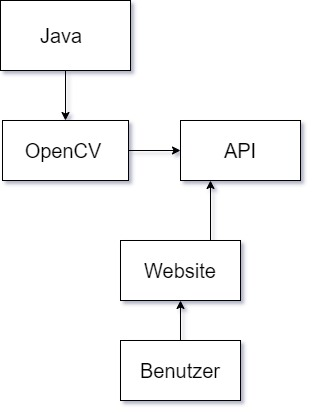

<h1 align="center" > Team5 </h1>

 

 Maslowski Lydia (Teamleiter) 
 

 Pfeiffer Mara 

 Sailer Stefan 

 

 

## Thema:

 

Das Zählen von Menschen, die ein und ausgehen in Öffendlichen Räumen wie Beispielsweise PlusCity.

 

 

## Ziele:

 

Menschen zählen, die ein Gebäude beträten und verlassen. (Plus City, Straßenbahnen)

(Linz AG arbeitet mit der PlusCity/Passage/Lentia zusammen. Straßenbahnen in der Stunde werden an die Shopping Centern/Menschen mengen angepasst.)

 

 

## Nichtziele:

 

Keine Tiere und kleine Kinder mit zählen

 

 

## Verwendete Technologien:

### Software:

[OpenCV](https://opencv.org/)

Java Framework

[Docker](www.docker.com)

 

### Hardware:

[Raspberry PI 4b (8 Gb)](https://www.amazon.de/Raspberry-Pi-Ersatzteil-Single-Board-102110421/dp/B0899VXM8F/ref=psdc_1626220031_t2_B07TC2BK1X)

[Raspberry PI Webcam](https://at.rs-online.com/web/p/raspberry-pi-kameras/9132664/)

 

 

### Systemarchitektur:

 

## Zeitplan:

 

|          Ziel          |  Abgabedatum  |                                 Infos                                         |       
|      :-----------:     |:-------------:|                       :----------------------:                                |
|         Planung        |   04.03.2021  |        Repository erstellen - Ziele finden - Equipment organisieren           |
|    Systemarchitektur   |   11.03.2021  |      FlowChart erstellen - Überlegung OpenCV kommuniziert mit Website         |       
|Paspberry laufen bringen|   31.03.2021  | Raspberry gestartet - Kamera verbunden - Remotedesktopverbindung eingerichtet |
|        Chart.Js        |   06.05.2021  |         Anzeige Anzahl Menschen um eine Uhrzeit im Gebäude sind               |
|  Open CV Installieren  |   20.05.2021  | installiert mit Anleitung, Link: [https://cbrell.de/](https://cbrell.de/blog/opencv-mit-dem-raspberry-pi-ein-einstieg/) |
|   Website, Protokoll   |   27.05.2021  |           Website erstellt (HTML, CSS) – Protokoll geschrieben                |
 

 

## Repository:

 

[https://github.com/leckaraxmuffin/cprTeam5.git](https://github.com/leckaraxmuffin/cprTeam5.git)

 

 
